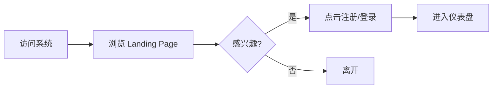
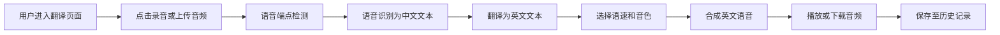
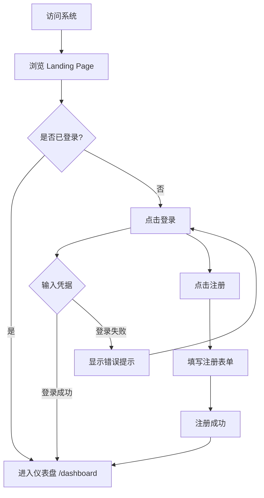

# 语音翻译系统 - 产品需求文档 (PRD)

## 1. 产品概述

语音翻译系统是一个基于Web的中文语音翻译平台，提供语音识别、翻译和语音合成的完整流程。用户可通过语音输入中文内容，系统自动识别并翻译为英文，再合成为语音输出。

- **目标用户**：语言学习者、跨境商务人士、旅行者
- **核心价值**：实时、高效的中文到英文语音翻译服务

## 2. 核心功能

### 2.1 用户角色

| 角色 | 注册方式 | 核心权限 |
|------|----------|----------|
| 游客 | 无需注册 | 浏览 Landing Page，了解产品功能 |
| 注册用户 | 邮箱/用户名注册 | 完整功能、历史记录、个人设置、快捷短语、语音词典 |

### 2.2 功能模块

1. **Landing Page（产品首页）**：品牌展示、功能介绍、用户评价、注册转化引导
2. **首页/仪表盘**：系统概览、快捷入口、使用统计、数据可视化
3. **语音翻译页**：核心翻译功能，语音输入→识别→翻译→合成输出
4. **历史记录页**：翻译历史查询、删除
5. **快捷短语页**：保存常用翻译短语，一键播放语音，预设短语库
6. **语音词典页**：查询词汇翻译和发音，支持搜索和自定义添加
7. **个人设置页**：账户信息、偏好设置、语速/音色配置
8. **登录/注册页**：用户认证入口

### 2.3 页面详情

| 页面名称 | 模块名称 | 功能描述 |
|----------|----------|----------|
| Landing Page | 导航栏 | 品牌 Logo、登录/注册按钮，滚动毛玻璃效果 |
| Landing Page | Hero 区 | 主标题、副标题、CTA 按钮、动态声波动画 |
| Landing Page | 功能展示 | 4 个核心功能卡片，自动轮播高亮 |
| Landing Page | 数据统计 | 识别率、用户数、翻译次数等数字动画 |
| Landing Page | 使用流程 | 三步流程说明 |
| Landing Page | 用户评价 | 3 条评价卡片 |
| Landing Page | CTA 区 | 注册转化引导 |
| Landing Page | 页脚 | 品牌信息、产品链接、支持、法律声明 |
| 首页/仪表盘 | 系统概览 | 显示今日翻译次数、成功率、平均耗时等关键指标 |
| 首页/仪表盘 | 数据可视化 | 翻译量趋势图、语速分布饼图、使用热力图 |
| 首页/仪表盘 | 快捷操作 | 快速进入翻译、查看历史、设置入口 |
| 语音翻译页 | 语音输入区 | 录音按钮、音频波形可视化、上传音频文件 |
| 语音翻译页 | 翻译展示区 | 中文识别结果、英文翻译结果、可编辑修改 |
| 语音翻译页 | 语音合成区 | 语速选择(慢/中/快)、音色选择、播放按钮、下载音频 |
| 语音翻译页 | 实时状态 | 处理进度条、各阶段状态指示器 |
| 历史记录页 | 历史列表 | 时间线式展示、分页加载 |
| 历史记录页 | 详情面板 | 查看单次翻译的完整信息、重新播放 |
| 快捷短语页 | 短语列表 | 卡片式展示常用短语，按分类筛选 |
| 快捷短语页 | 预设短语 | 内置问候、旅行、紧急等常用短语，一键添加 |
| 快捷短语页 | 自定义短语 | 手动输入中英双语，选择分类保存 |
| 快捷短语页 | 语音播放 | 点击短语即可播放英文语音 |
| 语音词典页 | 搜索栏 | 按单词/短语搜索 |
| 语音词典页 | 词典列表 | 展示单词、音标、翻译 |
| 语音词典页 | 添加词汇 | 输入单词、翻译、音标 |
| 语音词典页 | 语音播放 | 点击词汇播放发音 |
| 个人设置页 | 账户信息 | 头像、昵称、邮箱修改 |
| 个人设置页 | 偏好设置 | 默认语速、默认音色 |
| 登录/注册页 | 表单 | 邮箱/密码登录、新用户注册 |

## 3. 核心流程

### 3.1 访客浏览流程

### 3.2 语音翻译流程

用户进入翻译页面 → 点击录音或上传音频 → 系统进行端点检测和识别 → 显示中文文本 → 自动翻译为英文 → 用户选择语速和音色 → 合成英文语音 → 播放或下载

### 3.3 用户认证流程

### 3.4 快捷短语使用流程

用户进入快捷短语页 → 浏览已保存短语或从预设库选择 → 点击添加 → 点击播放按钮即可播放英文语音 → 可删除不需要的短语

### 3.5 语音词典使用流程

用户进入语音词典页 → 输入搜索词或浏览全部词汇 → 查看单词、音标、翻译 → 点击播放按钮听发音 → 可手动添加新词汇

## 4. 用户界面设计

### 4.1 设计风格

- **主色调**：深海蓝（#0F172A）作为背景基底，搭配翡翠绿（#10B981）作为主强调色
- **辅助色**：琥珀金（#F59E0B）用于警告/提示，玫瑰红（#EF4444）用于错误状态
- **按钮风格**：圆角胶囊形（rounded-full），带有微妙的渐变和阴影，hover时上浮效果
- **字体**：标题使用 "Outfit"（几何感、现代感），正文使用 "Plus Jakarta Sans"（清晰易读）
- **布局**：左侧固定导航栏 + 右侧主内容区，卡片式布局
- **图标风格**：Lucide图标库，线条简洁，与整体风格统一

### 4.2 页面设计概述

| 页面名称 | 模块名称 | UI元素 |
|----------|----------|--------|
| Landing Page | Hero | 全屏背景、大标题、动态声波、CTA按钮组 |
| Landing Page | 功能卡片 | 网格布局，图标+标题+描述，自动高亮轮播 |
| Landing Page | 数据统计 | 数字递增动画，渐变色文字 |
| 首页/仪表盘 | 数据卡片 | 4个统计卡片，数字动画递增，渐变图标背景 |
| 首页/仪表盘 | 趋势图表 | 面积图展示翻译量趋势，使用渐变填充 |
| 语音翻译页 | 录音按钮 | 大圆形按钮，脉冲动画，录音时变为红色波纹 |
| 语音翻译页 | 波形可视化 | Canvas实时音频波形，半透明渐变填充 |
| 语音翻译页 | 结果展示 | 左右分栏，中文/英文对照，支持复制和编辑 |
| 语音翻译页 | 控制面板 | 滑块选择语速，圆形头像选择音色，玻璃态背景 |
| 历史记录页 | 时间线 | 垂直时间线，卡片带hover效果，状态标签 |
| 快捷短语页 | 短语卡片 | 网格布局，分类标签，hover显示操作按钮 |
| 快捷短语页 | 添加弹窗 | 预设/手动输入切换，表单验证 |
| 语音词典页 | 搜索栏 | 搜索输入框，搜索/清除按钮 |
| 语音词典页 | 词典列表 | 垂直列表，显示单词、音标、翻译 |
| 语音词典页 | 添加弹窗 | 单词、翻译、音标输入表单 |
| 个人设置页 | 表单 | 分组表单，输入验证，实时反馈 |
| 登录/注册页 | 表单 | 全屏居中卡片，密码强度指示器 |

### 4.3 响应式设计

- **桌面优先**：基于1440px设计，左侧导航栏固定宽度（260px）
- **平板适配**：导航栏可折叠，主内容区自适应宽度
- **移动端**：底部导航栏，全屏内容区，触摸优化（最小点击区域44x44px）
- **断点**：sm(640px), md(768px), lg(1024px), xl(1280px)

### 4.4 可访问性 (WCAG 2.1 AA)

- 所有交互元素支持键盘导航（Tab/Enter/Space）
- 颜色对比度 ≥ 4.5:1（文本）和 ≥ 3:1（UI组件）
- 所有图标和图像提供 aria-label
- 表单元素关联 label，错误信息使用 aria-describedby
- 焦点指示器清晰可见（2px outline）
