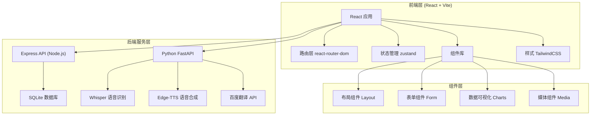

# 语音翻译系统 - 技术架构文档

## 1. 架构设计



## 2. 技术描述

- **前端框架**: React@18 + TypeScript + Vite
- **路由管理**: react-router-dom@6
- **状态管理**: zustand@4
- **样式方案**: TailwindCSS@3 + CSS变量
- **图表库**: recharts@2
- **图标库**: lucide-react
- **Node.js 后端**: Express + sql.js (SQLite in-memory + 持久化)
- **Python 后端**: FastAPI + uvicorn
- **语音识别**: OpenAI Whisper
- **语音合成**: edge-tts
- **文本翻译**: 百度翻译 API
- **音频处理**: librosa, soundfile, pydub
- **动画**: CSS动画 (微交互)

## 3. 路由定义

| 路由 | 页面 | 说明 | 认证要求 | 后端代理 |
|------|------|------|----------|----------|
| / | Landing Page | 产品首页，品牌展示和注册转化 | 无需认证 | 无 |
| /login | 登录 | 用户登录 | 无需认证 | Express (auth) |
| /register | 注册 | 新用户注册 | 无需认证 | Express (auth) |
| /dashboard | 仪表盘 | 系统概览和数据可视化 | 已登录 | Express (stats) |
| /dashboard/translate | 语音翻译 | 核心翻译功能页 | 已登录 | FastAPI (speech) |
| /dashboard/history | 历史记录 | 翻译历史查询和管理 | 已登录 | Express + FastAPI |
| /dashboard/phrases | 快捷短语 | 常用短语管理和语音播放 | 已登录 | Express |
| /dashboard/dictionary | 语音词典 | 词汇查询和发音 | 已登录 | Express + FastAPI |
| /dashboard/settings | 个人设置 | 账户信息和偏好设置 | 已登录 | Express |

## 4. 数据模型

### 4.1 前端类型

```typescript
// 用户数据
interface User {
  id: string;
  username: string;
  email: string;
  avatar?: string;
  createdAt: string;
  preferences: {
    defaultSpeed: 'slow' | 'normal' | 'fast';
    defaultVoice: string;
  };
}

// 翻译记录
interface TranslationRecord {
  id: string;
  chineseText: string;
  englishText: string;
  duration: number;
  createdAt: string;
  status: 'completed' | 'failed' | 'processing';
  speed?: string;
  voice?: string;
}

// 系统统计
interface SystemStats {
  totalTranslations: number;
  todayTranslations: number;
  successRate: number;
  avgDuration: number;
  dailyTrend: { date: string; count: number }[];
  languageDist: { name: string; value: number }[];
  hourlyUsage: { hour: string; count: number }[];
}

// 快捷短语
interface Phrase {
  id: string;
  chineseText: string;
  englishText: string;
  category: string;
  createdAt: string;
}

// 词典条目
interface DictionaryEntry {
  id: string;
  word: string;
  translation: string;
  phonetic?: string;
  audioUrl?: string;
  createdAt: string;
}
```

### 4.2 数据库表结构 (SQLite)

```sql
-- 用户表
CREATE TABLE users (
  id TEXT PRIMARY KEY,
  username TEXT NOT NULL,
  email TEXT UNIQUE NOT NULL,
  password TEXT NOT NULL,
  avatar TEXT,
  created_at TEXT DEFAULT (datetime('now')),
  default_speed TEXT DEFAULT 'normal',
  default_voice TEXT DEFAULT 'female_us'
);

-- 翻译记录表
CREATE TABLE translations (
  id TEXT PRIMARY KEY,
  user_id TEXT NOT NULL,
  chinese_text TEXT NOT NULL,
  english_text NOT NULL,
  input_audio_path TEXT,
  output_audio_path TEXT,
  duration REAL DEFAULT 0,
  speed TEXT DEFAULT 'normal',
  voice TEXT DEFAULT 'female_us',
  status TEXT DEFAULT 'completed',
  created_at TEXT DEFAULT (datetime('now')),
  FOREIGN KEY (user_id) REFERENCES users(id) ON DELETE CASCADE
);

-- 快捷短语表
CREATE TABLE phrases (
  id TEXT PRIMARY KEY,
  user_id TEXT NOT NULL,
  chinese_text TEXT NOT NULL,
  english_text TEXT NOT NULL,
  category TEXT DEFAULT 'custom',
  created_at TEXT DEFAULT (datetime('now')),
  FOREIGN KEY (user_id) REFERENCES users(id) ON DELETE CASCADE
);

-- 语音词典表
CREATE TABLE dictionary (
  id TEXT PRIMARY KEY,
  user_id TEXT NOT NULL,
  word TEXT NOT NULL,
  translation TEXT NOT NULL,
  phonetic TEXT,
  audio_url TEXT,
  created_at TEXT DEFAULT (datetime('now')),
  FOREIGN KEY (user_id) REFERENCES users(id) ON DELETE CASCADE
);
```

## 5. API 接口

### 5.1 Express API (端口 3001)

| 方法 | 路径 | 说明 | 认证 |
|------|------|------|------|
| POST | /api/auth/register | 用户注册 | 否 |
| POST | /api/auth/login | 用户登录 | 否 |
| GET | /api/user/profile | 获取用户信息 | 是 |
| PUT | /api/user/profile | 更新用户信息 | 是 |
| POST | /api/translations | 创建翻译记录 | 是 |
| GET | /api/translations | 获取翻译列表 | 是 |
| DELETE | /api/translations/:id | 删除翻译记录 | 是 |
| GET | /api/stats | 获取统计数据 | 是 |
| GET | /api/phrases | 获取短语列表 | 是 |
| POST | /api/phrases | 创建短语 | 是 |
| DELETE | /api/phrases/:id | 删除短语 | 是 |
| GET | /api/dictionary | 获取词典列表 | 是 |
| POST | /api/dictionary | 创建词典条目 | 是 |
| DELETE | /api/dictionary/:id | 删除词典条目 | 是 |

### 5.2 Python FastAPI (端口 8001)

| 方法 | 路径 | 说明 |
|------|------|------|
| POST | /api/speech/detect-endpoint | 语音端点检测 |
| POST | /api/speech/preprocess | 音频预处理 |
| POST | /api/speech/recognize | 语音识别 |
| POST | /api/speech/synthesize | 语音合成 |
| POST | /api/speech/pipeline | 完整翻译流程 |
| POST | /api/translate | 文本翻译 |
| GET | /api/health | 健康检查 |
| GET | /api/config/voices | 获取可用音色配置 |
| POST | /api/audio/upload | 上传音频文件 |
| GET | /api/history | 获取历史记录 |
| POST | /api/history | 保存历史记录 |
| DELETE | /api/history/:id | 删除历史记录 |

## 6. 项目结构

```
├── src/                      # 前端源码
│   ├── api/                  # API 客户端
│   │   └── client.ts
│   ├── components/           # 公共组件
│   │   ├── Header.tsx
│   │   ├── Layout.tsx
│   │   ├── Sidebar.tsx
│   │   └── StatCard.tsx
│   ├── constants/            # 常量配置
│   ├── pages/                # 页面组件
│   │   ├── Landing.tsx       # 产品首页
│   │   ├── Login.tsx
│   │   ├── Register.tsx
│   │   ├── Dashboard.tsx
│   │   ├── Translate.tsx
│   │   ├── History.tsx
│   │   ├── Phrases.tsx
│   │   ├── Dictionary.tsx
│   │   └── Settings.tsx
│   ├── store/                # Zustand 状态管理
│   ├── types/                # TypeScript 类型定义
│   ├── App.tsx               # 路由配置
│   ├── main.tsx              # 应用入口
│   └── index.css             # 全局样式
├── api/                      # Node.js 后端
│   ├── db.ts                 # 数据库配置
│   ├── seed.ts               # 种子数据
│   └── server.ts             # Express 服务
├── python-api/               # Python 后端
│   └── app/                  # FastAPI 应用
├── uploads/                  # 音频文件上传目录
├── data.db                   # SQLite 数据库
├── package.json
├── vite.config.ts
├── tsconfig.json
├── tailwind.config.js
├── requirements.txt
├── start-all.bat             # 一键启动脚本
└── start-api.bat             # 启动 API 脚本
```

## 7. 部署说明

- **前端**: `npm run dev` (开发) / `npm run build` (生产构建)
- **Node.js 后端**: `npm run server` (端口 3001)
- **Python 后端**: `python python-api/app/main.py` (端口 8001)
- **一键启动**: `start-all.bat`
- **数据库**: SQLite (data.db)，由 sql.js 管理，每次写操作自动持久化
- **Vite 代理**: 开发时 `/api/*` 根据路径前缀转发到 Express (3001) 或 FastAPI (8001)
